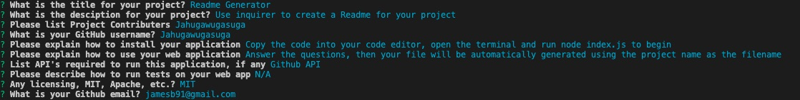
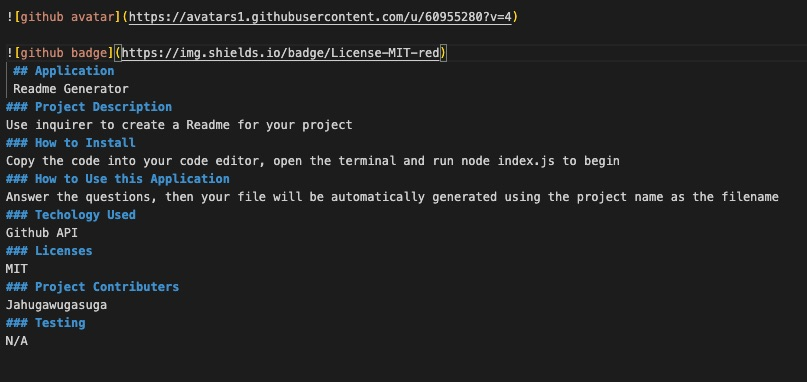
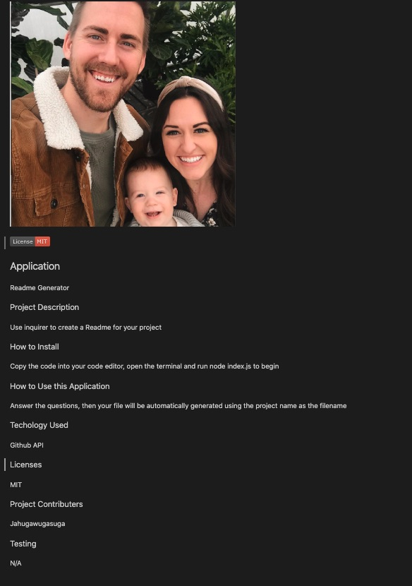

<<<<<<< HEAD
=======
# readmegenerator
>>>>>>> 711bb938bbedf7be056ec77000aa99c1c65fae24

 ## Application
 Readme Generator 
### Project Description
Use inquirer to create a Readme for your project

### How to Install
Copy the code into your code editor, open the terminal and run node index.js to begin
### How to Use this Application
Answer the questions, then your file will be automatically generated using the project name as the filename
### Techology Used
Github API

---

### Licenses
MIT
### Project Contributers
Jahugawugasuga
### Future Dev
Add templates for photos 
Fix the Badges so it renders properly from the URL

